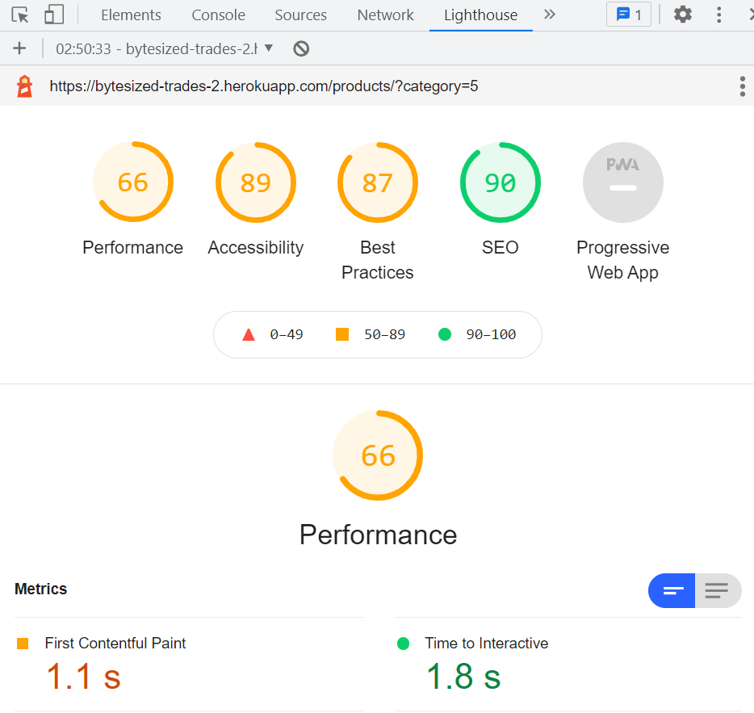

# ByteSized Trades
## A Full Stack Development Project by Edward Stanley
Bytesized Trades is a website with one goal in mind, to give players of the game 'Pokemon' a forum in which they can request pokemon they want added to their team. It utilises a one time subscription based system allowing users to only pay once to send pokemon requests on checkout. Pokemon is a popular game by Nintendo with the main mechanics being catching and levelling up pokemon for battle. Another important part is pokemon trading, specifically with other people who own the game. However Nintendo has taken down the ability to find people to trade with for older games hence this website seeks to create a new platform for players to do so. 

The current setup of the site is that the owner holds a database worth of pokemon they are looking to trade off, so instead of asking around aimlessly, those trainers now come to him. The website has the ability for the owner to add pokemon, edit them, and delete them if they no longer exist. As each pokemon is unique, the website doesn't focus on quantity but rather the handling of multiple types of similar pokemon.

The users are able to access the website anomynously, or create an account which gets verified by email, and add pokemon they want to request to the bag. Due to the nature of this, the same id pokemon cannot be added by the user twice as there is essentially one copy of each. Once the subscription has been paid, the user can then checkout those pokemon by providing their own trainer code and email (Else the user would have no way to communicate with them to trade).
#
## User Stories
### The Owner -
    - Wants to advertise all the pokemon they have
    - Wants people to be able to add them to the bag and remove if necessary
    - Wants to be able to contact the user after the request is made using the user's trainer code
    - Would want to make a profit via handling fee of each request

### The General user -
    - Wants to have access to the full database of pokemon available
    - Wants to be able to filter out the pokemon to better find the ones they want
    - Wants to be able to sign up to the website, and have an email sent to them for validation
    - Shouldn't be able to access the log out or profile page

### The Authorized user -
    - Wants to be able to keep track of orders they have made in their personalised Profile page
    - Wants to be able to update their key details if necessary
    - Wants to be able to access the same things as an unauthorised user
    - Shouldn't have any of their details made vunerable if logged in
    - Shouldn't have the option to sign up or sign in

### The Superuser -
    - Wants to be able to add/edit/or delete pokemon as necessary
    - Wants to ensure non superusers cannot access these methods
#
## Wireframes
The following wirefrane was made in Balsamiq  
[Please Click Here.](read_me_resources_/wireframe_ms3.pdf)

The wireframe can also be found in the readmeassets folder included in this project
#
## Database Scheme
The following database scheme was made in DBDiagram

The database scheme had two key relationships in this project:
1) The product information and sorting. Category being linked to both type1 and type2 of Info led to some creative use of the pk and name of each type for image sourcing and alternate text if an image couldn't load. Category also became a very unique model in the sense that it had an extra field, pk 19 empty, purely for catching any pokemon that didnt have a second type. The structure of Info was also uniquely suited to my project. These two combined with UserProfile, which allowed for the owner of the pokemon to be stored in it (which i recommend testing using the edit function as the default for the pokemon is 'None' currently) gives great functionality to the core design of my website, as each product houses the trainer code of its owner for trading.
2) The relationship between Order and OrderLineItem. This allowed for each order to have a full breakdown of every product contained within it, as OrderLineItem held the Pokemon (and subsequently the owner of it). This coupled with Order being able to hold the user's information on checkout gave the Owner/User pairing I aimed for.
#
## Style and Colour Scheme
Due to personal reasons I wasn't able to styalise the website as much as I initially wanted, however I still based what I have submitted with good design in mind
- I tend to prefer to use darker, more subtle colours for the backgrounds of websites as it is much easier on the eyes. It also has the added bonus of making the white text fields of the forms contrast better so that the user's eyes focus on them more. 
- For the nav dropdown buttons of all the different types, I elected to use the actual type images from the mainline pokemon series and edited them to have a clearer outline. As the website is built with pokemon fans in mind, this I believe is a key factor for user engagement. The buttons are also coloured uniquely for each type making it much easier visually to search them on the product menu
- Text has a clear order of predecence throughout the website. Any text that is more important is typically larger than the rest. Examples include the pokemon names on the products page, headers on some website pages etc
- The images of the pokemon are large and clear to the user. As the majority of pokemon sprites from the games use pixels, I reduced the apparentness of it by limiting the size of the image in some places.
#
## Existing Features
I will be covering the features on an app by app basis
### The Base Directory / Home App
- Contains a structured layout thatnks to Bootstrap which was the majority of the stylings for this project too
- Contains the formatting necessary to deploy the website to Heroku
- Contains a settings app which takes Heroku's Config Vars for the more sensitive links which helps secure the site
- Contains a static folder which is accessed and saved in Google Cloud in order to give additional stylings at points in the project
- Contains a structured nav with collapsable links which keeps screen coverage minimal
### The Goods App
- The Ability to add a pokemon if you are a superuser
- The Ability to edit a pokemon if you are a superuser
- The Ability to delete a pokemon if you are a superuser
- On a regular load iterates through all the pokemon in a database, displaying them all in a card like format with the name, picture, types, level, and the pokemon's owner
- On a load specified by the type buttons, filters the list to streamline the users experience to find what they want. In terms of pokemon types is a very important factor.
- On a load specified by the search bar, filter the list to any pokemon containing the submitted string, again this streamlines the experience for the user allowing them to get what they want quicker.
- When a pokemon's image is clicked, it takes the user to a more detailed view of its stats, as well as presenting the user with the option to add the pokemon to their bag.
### The Bag App
- The ability to view what pokemon the user has selected thus far, and a breakdown of each one, to let the user keep track easier.
- The ability to remove a pokemon from the bag if the user deems they dont want it anymore
- The ability to send the user to checkout the pokemon they have so far, or return to the rest whilst keeping the session open so that the user doesnt lose their additions
### The Profile App
- Uses Allauth to allow for secure sign in, sign out and secure general activities
- Uses Allauth's authentication system by sending the User a confirmation email
- Allows for protection against non admin users from accessing features they shouldnt such as adding products
- Whilst it cannot render them currently, I unfortunatley ran out of time, it returns the order number to the profile so users can see their past order numbers. Ideally it would show them a breakdown but I decided to keep it in as it proves there is a point to logging in
### The Checkout App
- Takes a form consisting of the user's inputs, whether anomynous or not, and generates a success page provided that the form is valid.
- Uses Stripe as an optional donation if the user wishes to contribute towards the project, payments successfully come up through stripes system
- Gives a clear breakdown of the order on success reminding the user what they have requested from the owner. Stripe provides feedback to the user in the event their card details are incorrect.

### Features yet to be added
- Greying out the add to cart button if the user already has that pokemon requested in their bag
- As set up by the foreign key in model Info, the ability for the user to make their own pokemon and add them to the system. 
They would only be able to delete and edit their own. This wasnt implemented due to unsurity if it would contradict L03.3, however the system is wholly in place for it. All it would require is the user accessing products/add (Which is currently superuser only due to L03.3)
- An alternate to the checkout system where the user has an option of adding one of their pokemon to the order form, which would then have the details sent to the owner forming a better trade. This wasnt added due to the point above.
- The Info model and early commits have a price assigned which I initially wanted to implement however opted for the donation due to time. It still being there allows me to adapt it in future. The same occurs with the abilities which again would be nice to include however editing 801+ fixtures would've taken a while 
- The ability to filter respective to a specific stat i.e hp. I unfortunatley ran out of time to do any more filtering
- Sending an email to the user with the request receipt and the trainer ID of the pokemon's owner, the website can send emails as evidenced by Allauth login however I ran out of time for the checkout
- A subscription system where the user pays x amount a month to be able to send requests to others for trades. I experimented with this as shown through commits but unfortunatley ran out of time before it could be implemented. I decided to at least have the 'Subscription cost' on each checkout to at least show the stripe functionality. I covered this with my mentor prior who said it should be ok.
#
## Code Validation

### HTML W3 Validation
- Upon running the HTML through the validator, the only popup of note was a warning stating that using 'widht:100%' and 'height:auto' was not common for an Img variable, however due to time and a lack of importance I decided to leave it

### CSS W3 Validation
- This fixed an issue I initally had with my @media version of the main content holder, which was designed to increase the padding to avoid nav overlap on smaller screens. I had forgotten to put a measurement for the width identifier and after fixing that no problems occurred.

### JSHint Validation
- Despite to the majority of the code for this coming from Stripe, I ran the stripe_elements.js through the validator regardless. No errors to note came about

### Flake 8
- I used Flake 8 to identify the vast majority of issues with the python code, There ended up being a lot purely due to python being very specific about indentation, line length, and whitespace. I resolved the vase majority of these issues, but was forced to leave some errors such as long strings of text in settings.py

### Lighthouse Validation

I decided to test a varying number of pages to check my website's responsitivity. Overall Accessability, SEO, and Best Practices scored quite highly generally above 80. The varying factor however was Performace. On most pages it was perfectly fine. When it was on a filtered view of the products it was ok but could be better, when asked to load all of the products itself it was not happy. Given time, I believe the best fix for this would be to implement a page system, breaking up how many images need to be retrieved in one go providing a much better user experience. The image specifically shown is when testing responsitivity on filtering the products by electric typage.

### Other Validation
A lot of manual testing went on during the making of this project. I would often use print(x) to check the status of models or just display something if a particular section of code is working. My problem solving through this method and the debug combined proved instrumental in completing the project.
#
## Testing
Over the project there were multiple small flaws such as missing an s off a variable stopping the ListInlineItem from going inline, however I would like to identify some of the key problems I had whilst working on this website:

### Two Foreign Keys for Info
The Info model contains the variables type1 and type2, which can range from  
1-18 usually due to 18 types being in the game. The problem however was that type2 didnt always have a value hence couldnt link up with a foreign key. 
To solve this I created a 19th category with a value of 19 as essentially a null category. Any items which initially didnt have a second type were assigned to it to avoid any null errors with the key.

### Some Pokemon not having images
The database of image files I used unfortunatley only provided generations 1-6, leaving 7-8 with no image data. To solve this I researched a way to check the filepath of the Img attribute and found the 'onerror' tag which I used inline python and java to redirect to the default image instead.

### Loaded migrations stopping progress
A huge frustration through this was when a migration and data was already loaded for a model, it very much did not like changes to it. Hence in order to run the migration I would often have to start a new workspace, reinstall everything using pip3, and then migrate. I tried searching on the web for a quicker way to do this to no avail.

### Images not showing on mobile IOS
After finally getting the Google Cloud working (which was an ordeal in itself) the images for all the links were no more. Turns out IOS doesn't seem to like my website, and unfortunatley I couldnt find a work around for this. I asked for help with the student tutors but also failed to solve the issue. It does however appear to work on Android etc. It is worth mentioning I had to use Google Cloud because AWS kept failing to recognise my bank details, and according to the email I recieved after asking them for help as a security concern they can only respond to users with an authenticated payment system. Therefore unfortunatley the website ios issues were out of my hands.

### Visual bugs with some bootstrap elements
Whilst the majority of the user GUI experience is nicely laid out and centered as I wanted, unfortunatley some screens for whatever reason refused to center. I unfortunatley ran out of time before I could fix them

## Testing User Stories

### The Owner -
##### *" Wants to advertise all the pokemon they have"*
- The python logic is sucessfully able to iterate through all pokemon in the database
- The owner can add or delete any pokemon from the database using the Superuser login allowing them to choose which pokemon they display
- The owner can also edit the pokemon if something changes i.e. a pokemon levels up
##### *" Wants people to be able to add them to the bag and remove if necessary"*
- The owner has provided functionality which allows users to add and remove from their bag, with the user being notiied on success of each action by the 'Number of items in bag' in the top right updating each time. Due to the nature of pokemon with each one having so many unique attributes a duplicate is near impossible, hence the owner has also added functionality to ensure the same pokemon id cant be added to the bag twice.
##### *" Wants to be able to contact the user after the request is made using the user's trainer code"*
- Upon checkout the user's email and trainer ID are stored with the order giving what the owner needs to contact the user. Currently the owner can access this by going into the admin, however if I had more time I would have an email sent to the user and the owner.
##### *" Would want to make a profit via handling fee of each request"*
- The Stripe functionality in the checkout system is fully operational, as mentioned I would prefer it going to a subscription system in future

### The General user -
##### *" Wants to have access to the full database of pokemon available"*
- The user is able to see the whole database of pokemon, and click on said pokemon for a detailed view of the stats
##### *" Wants to be able to filter out the pokemon to better find the ones they want"*
- The user is able to filter by name and type to better find which pokemon they want, ideally in future they can also sort by the specific stats such as hp - highest to lowest
##### *" Wants to be able to sign up to the website, and have an email sent to them for validation"*
- Using Allauth, the website has full validation allowing users to make accounts safely, as well as receive a validation email
##### *" Shouldn't be able to access the log out or profile page via nav menu"*
- The code checks if a user is logged in, and automatically hides any links bar the log in and sign up 

### The Authorized user -
##### *" Wants to be able to keep track of orders they have made in their personalised Profile page"*
- Whilst the database scheme and model setup allows this, currently it shows the database queryset. I was unable to implement an individual view of each product due to time, but decided to keep in the raw values to better prove the system works
##### *" Wants to be able to update their key details if necessary"*
- The user is able to update their details on the profile screen, saving it to the database. This can be used by the owner to better find the person to trade with. This is also better used in the future functionality I wish to implement with assigning each pokemon with its maker, as changing the values on the profile page would update it for every owned pokemon.
##### *" Wants to be able to access the same things as an unauthorised user"*
- The user is still able to access the full list of products and checkout services whilst logged in.
##### *" Shouldn't have any of their details made vunerable if logged in"*
- Allauth helps protect the user from any security issues.
##### *" Shouldn't have the option to sign up or sign in"*
- The sign in and log in buttons are replaced with log out and profile if the user is logged in

### The Superuser -
##### *" Wants to be able to add/edit/or delete pokemon as necessary"*
- The superuser is able to add/edit/delete pokemon as necessary
##### *" Wants to ensure non superusers cannot access these methods"*
- The website has validation on these methods against non super users

Overall whilst some parts of the website could be improved to better fit the user stories, I believe I have covered the full functionality of what I set out to do.
#
## Deployment
The steps on how I deployed the project are outlined below:
1) I created a new app and chose the region closest to me (Europe)
2) I accessed Heroku's add-ons and installed the Postgres database
3) I installed Gunicorn and created a Procfile to set up the link
4) I used the database link to link my app to Heroku
5) I migrated across all of my migrations
6) I added the heroku app to the Allowed Hosts
7) I enabled automatic deployment to Heroku for my git repository
8) I created a bucket in Google Cloud, created a media folder and put all of the images in there.
9) I let the bucket collect all of the static files into a static folder, and then disabled collect static
10) I added any other remaining key variables such as the Stripe keys into the Config Vars to be accessed securely

### Forking the GitHub Repository
You can fork the project and make changes to it:
1) Access the github repository
2) Click the fork button at the top right of the page

### Making a Local Clone
1) Log into Github and locate the GitHub Repository.
2) Under the repository name, Click the 'Code dropdown and select 'Clone or download'
3) Clone the repository using HTTPS
4) Change the current directory to where you want the clone to be made
5) Type 'git clone' and paste the URL, and then submit

## Notes about site security:
I had two major security concerns in the project:
1) Accidently commiting the Heroku database link whilst testing deployment
2) Accidently forgetting to put credentials.json in .gitignore and revealling bucket information

Please note that for both of these cases I 1) Created a new heroku app with new database link, 2) Created a new bucked and Json file and placed the file in the gitignore.
The websites security is not under threat and I can prove so if requested, The main reason I mention this is that I am unsure how to remove the information from the commits (Hence why i made new ones) so please be aware that the database in the commits and the json file are not the ones used for deployment and static file holding.
#
## Technologies used:
### Languages:
HTML - Used for the base website buildup and links
CSS - Used for general stylings, mainly made use of the bootstrap classes to styalize my website
Javascript - Used majorly for the stripe payments, added some user experience benefits through the 'onerror' code for images
Python - The basis for all the app view logic and pathing, allowed for python logic in multiple areas, most notably the products page

### Other key technologies:
Django - The main framework for the project
Heroku - Allowed for deployment of the app
Crispy Forms - Allowed for the forms to be displayed much nicer
Bootstrap - Instrumental for the styalizing of my project
Balsamiq - Allowed for wireframe creation to plan out my views
Allauth - Allowed for secure user registration
Stripe - Allowed for secure checkouts
Gunicorn - Used to deploy to Heroku
Google Cloud Storage - Used to store all the static and media files for the website via bucket
FontAwesome - A couple of icons to add user experience
Gimp Studio - Used to edit images for the website

#
## Credits
### General Code Layout
For the purpose of this project I referred to and used authentication from the Code Institute Chris's Boutique ADO. This was inevitable as comleting the Boutique Ado project was how I learned the required skills for this project. However I believe I have differentiated the project enough through my own bootstrap analysis, and database scheme in order to support my own user stories. I have tried to specify how much a part deviates through comments throughout my code. The repository for Boutique Ado can be found [here.](https://github.com/Code-Institute-Solutions/boutique_ado_v1)
### Code Specifics
A major part of the borrowed code is for google cloud to access my static files, as well as tutor Igor helping me reformat it.
The steps I took and tried to better fit me is from [here.](https://stackoverflow.com/questions/40127675/serve-static-files-from-google-cloud-storage-bucket-for-django-app-hosted-on-gc)
### Data for Databases
The Json for Info fixtures was largely manipulated by myself however the origonal source of the data was from [here.](https://bulbapedia.bulbagarden.net/wiki/List_of_Pok%C3%A9mon_by_base_stats_(Generation_I))
I copied and pasted the tables into Excel, and then used Windows Powershell to convert it to Json, plus minor text formatting to make it a viable fixture.
### Media
The sprites for each pokemon are gotten from [here.](https://veekun.com/dex/downloads), There was not much editing to speak of.

The images for each pokemon type are gotten from [here.](https://brickbronze.fandom.com/wiki/Appendix:Pok%C3%A9mon_Types), This took a lot more editing as they were all in the same image. I also resized them so the default maximum size would be suitable for me.

I should mention however that despite the source links all of the images are using assets from Nintendo's Pokemon.
#
## Acknowledgement

A huge thank you to the Student Care team, especially Kieron, whom without which this definitely wouldn't have been possible. It has been a nightmare of a month with illness and bereavement, and thankfully now I have a valid project to submit.

Also a thank you to Igor, who helped me figure out why the ListItemInline wasnt inline in the admin

A lot of work has gone into this project, and I do wish that I had more time to flesh it out, but I am happy with the result and I believe it meets all of the criteria.
#